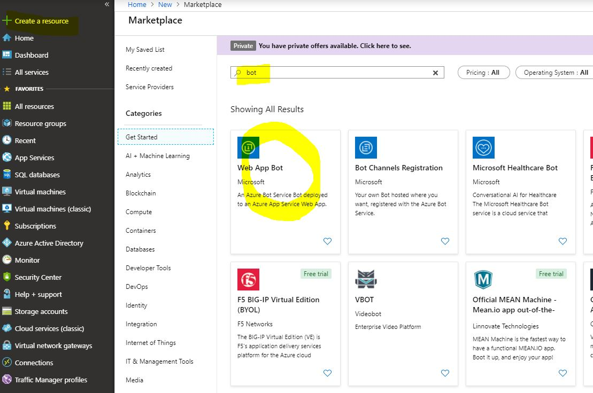
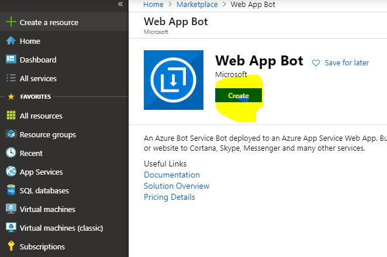
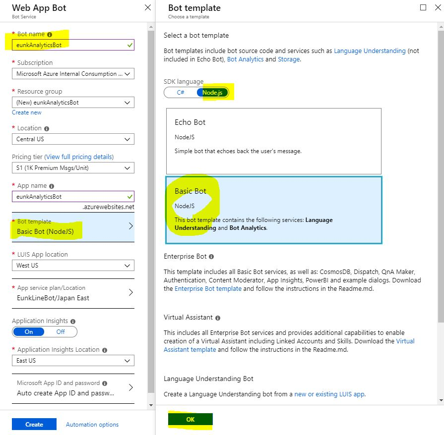
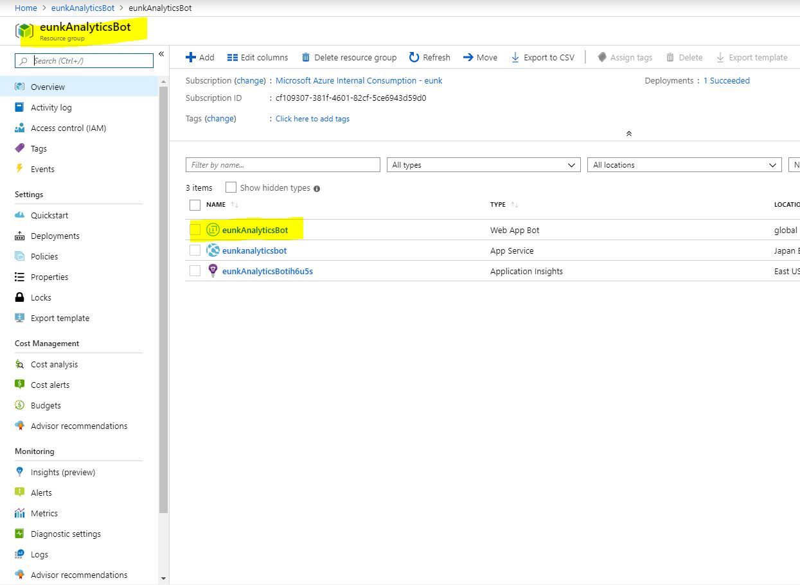
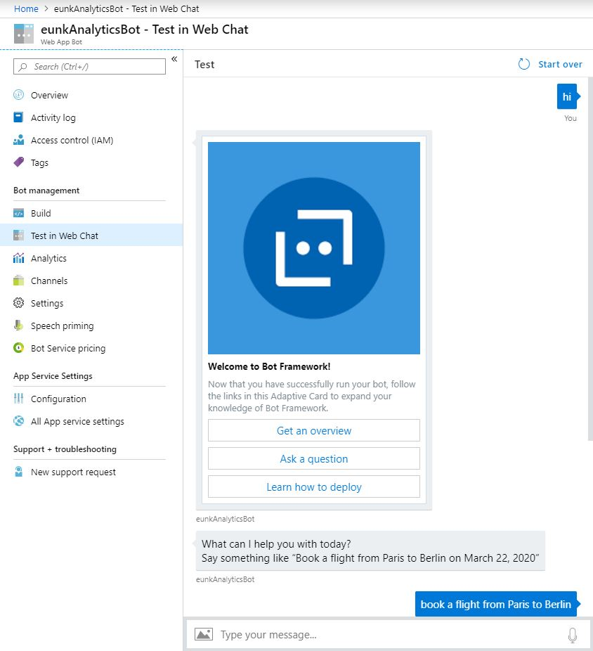
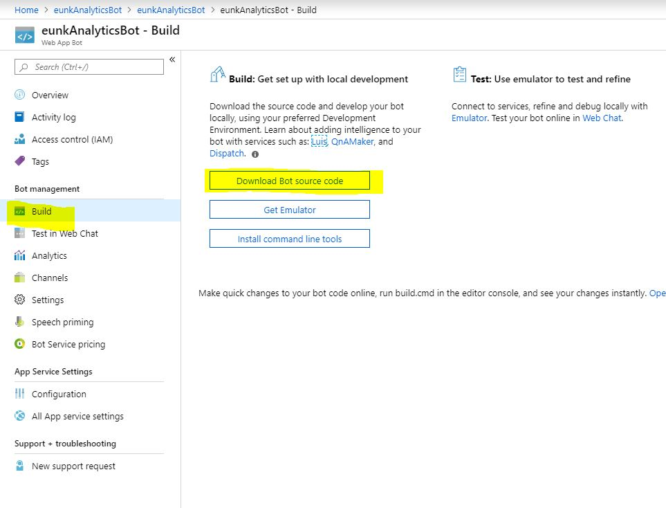
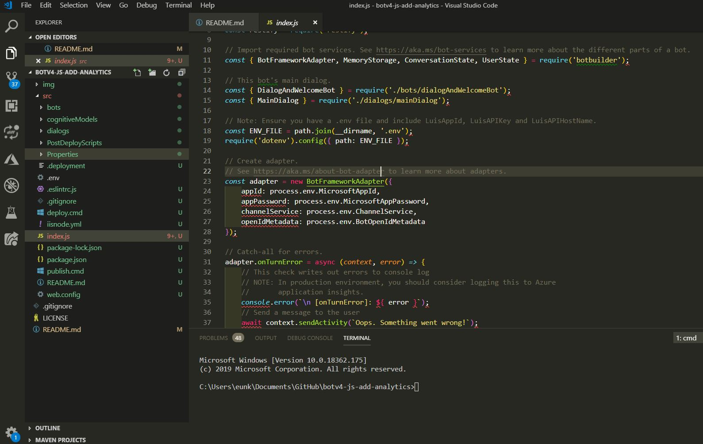
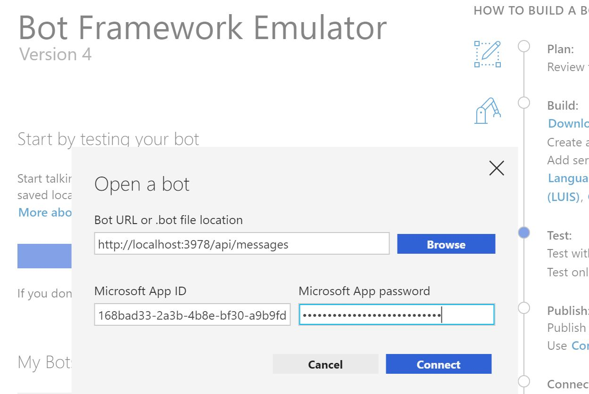
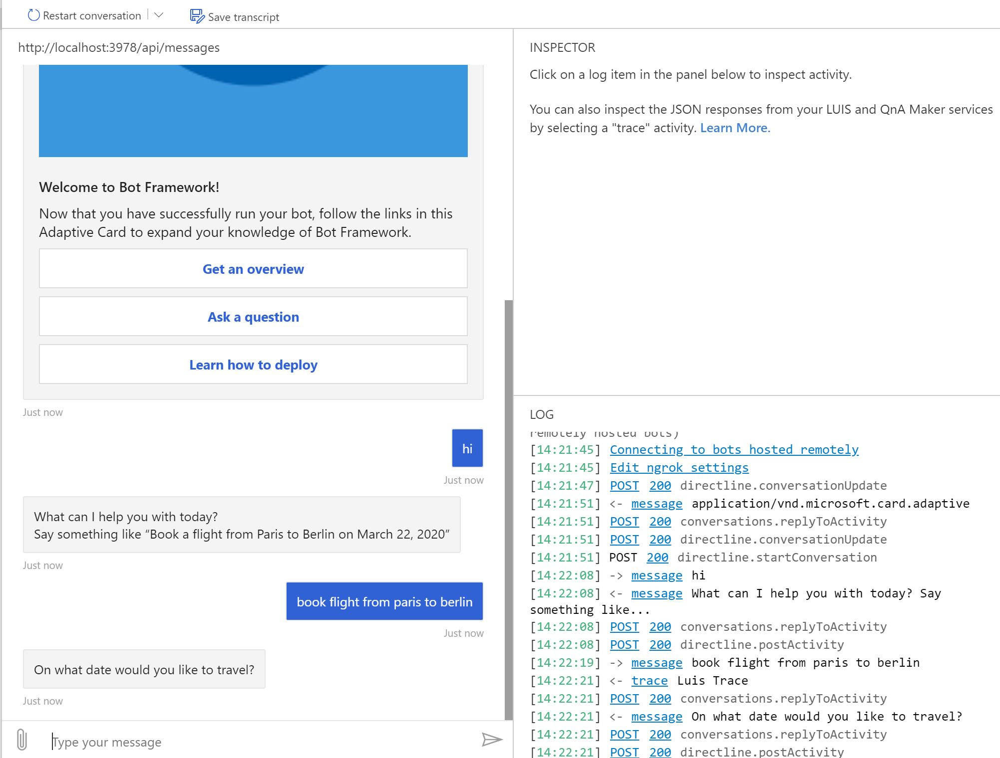

# botv4-js-add-analytics

After you built a bot, you may want to build an analytics dashboard to manage the bot. 
For example, you want to check how many users use my bot? or which dialog is most popular? or.. fancy word cloud for my bot data.


It will take a while if you need to make this dashboard from scratch.

There is an awesome project powered by [Virtual Assistant team](https://github.com/microsoft/botframework-solutions/blob/master/docs/readme.md#analytics) which is implemented all the dashboard and queries for this.
All you need to do is 1.Add Application Insights service to your bot 2.Add some codes to your bot to send telemetry info 3.Check the nice dashboard using ApplicationInsightId. 
However, there is no step by step documentation around this, so that's why I wrote this post!
If there is something missing or wrong, please kindly let me know! ;)

## Set up Basic JS bot 
Please follow the steps below to setup the basic JS bot to test.
If you already have your own bot, you can use it! 

### Create the Web App Bot at Azure Portal


```
You need to change the Bot Service Name to different one which needs to be *globally unique*. If not, it will show you an error.
```


### Test your bot at the Azure Portal
You can simply test the bot after the deployment is completed like this.
1. Go to the **Azure Bot Service** and click the **Test in Web Chat** Panel.



### Download your bot to your machine and open it using editor. 
1. Go to the **build** panel and click the **Download Bot Source Code** button. It will take a while to prepare a zip file.

2. Open the source code using editor.

3. Install the npm package before starting the bot locally. 
```node
npm install 
```
4. Test the bot locally
```node
npm start
```
Please don't forget to put your **MicrosoftAppId, MicrosoftAppPassword** when you start your bot.


Now your bot is ready and all you need to do is add few lines of code and see if it works ;)

## Add Telemetry Code to your bot
### Include the extra packages you need to implement telemetry code
1. Install **botbuilder-applicationinsights** package 
```
npm install --save botbuilder-applicationinsights
```
2. Import required service(BotTelemetryClient, NullTelemetryClient) to your **index.js** file
```node
const { BotFrameworkAdapter, MemoryStorage, ConversationState, UserState, BotTelemetryClient, NullTelemetryClient } = require('botbuilder')
const { ApplicationInsightsTelemetryClient, ApplicationInsightsWebserverMiddleware } = require('botbuilder-applicationinsights');
```

## Connect to Power BI dashboard


This repository explains how to implement analytics feature to the Microsoft Bot Framework v4 js bot.
