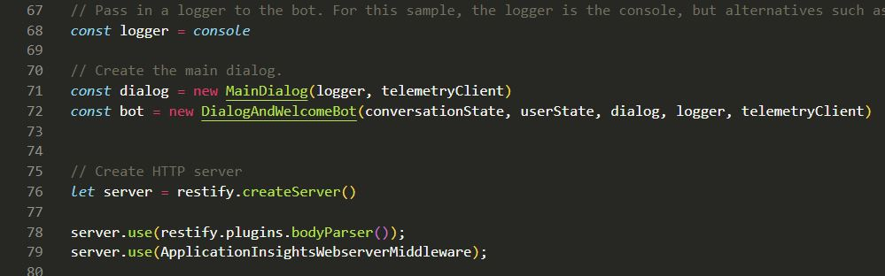
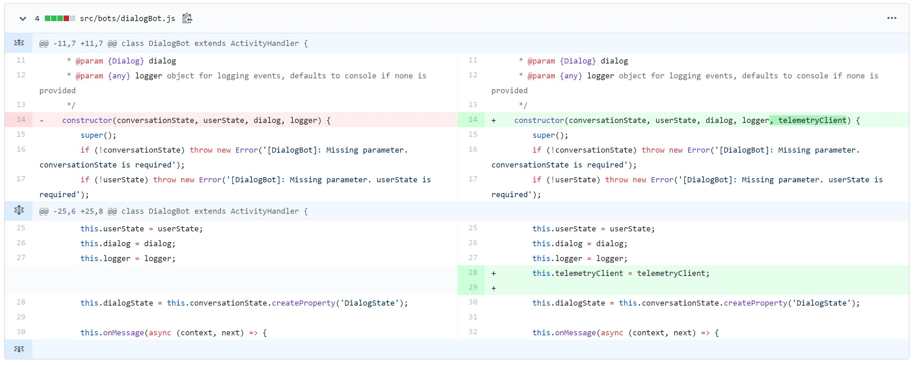
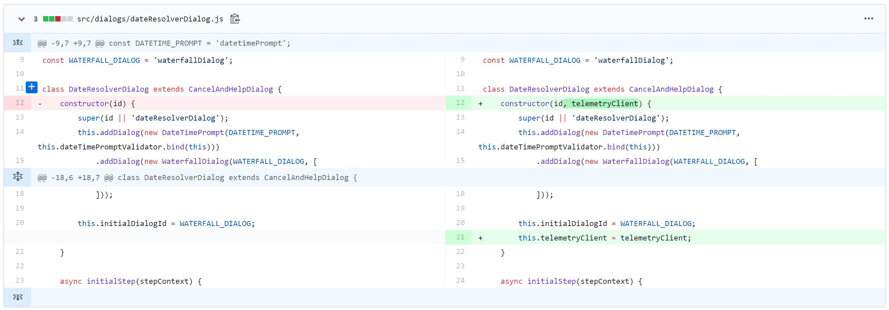
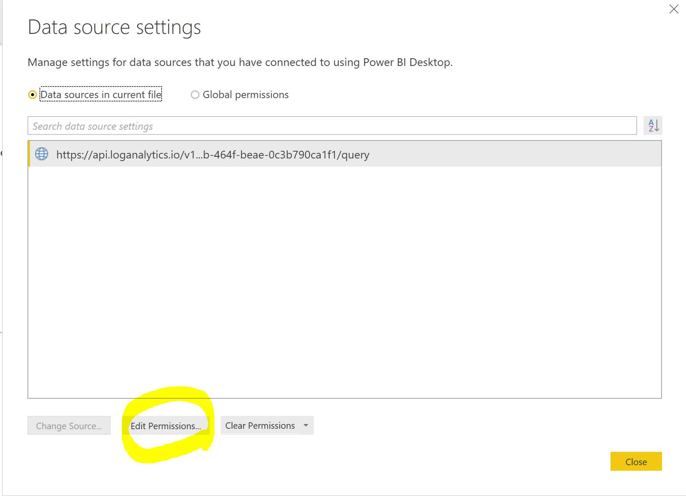

# botv4-js-add-analytics

After you built a bot, you may want to build an analytics dashboard to manage your bot. 
For example, you want to check how many users use my bot? or which dialog is the most popular one? or.. fancy word cloud for my bot data.


It will take a while if you need to make this dashboard from scratch.

There is an awesome project powered by [Virtual Assistant team](https://github.com/microsoft/botframework-solutions/blob/master/docs/readme.md#analytics) which is implemented all the dashboard and queries for this.
All you need to do is **1.Add Application Insights** service to your bot **2.Add few lines of codes to your bot to send telemetry info** and **3.Check the nice dashboard using ApplicationInsightId.** 
However, there is no step by step documentation around this, so that's why I wrote this post!
If there is something missing or wrong, please kindly let me know! ;)

## 1. Set up Basic JS bot 
Please follow the steps below to setup the basic JS bot to test.
If you already have your own bot, you can use it! 

### 1-1. Create the Web App Bot at Azure Portal


You need to change the Bot Service Name to different one which needs to be **globally unique**. If not, it will show you an error.


### 1-2. Test your bot at the Azure Portal
You can simply test the bot after the deployment is completed like this.
1. Go to the **Azure Bot Service** and click the **Test in Web Chat** Panel.


### 1-3. Download your bot to your machine and open it using editor. 
1. Go to the **build** panel and click the **Download Bot Source Code** button. It will take a while to prepare a zip file.

2. Open the source code using an editor.

3. Install the npm package before starting the bot locally. 
```node
npm install 
```
4. Test your bot locally
```node
npm start
```
Please don't forget to put your **MicrosoftAppId, MicrosoftAppPassword** when you start your bot.


Now your bot is ready and all you need to do is add few lines of code and see if it works ;)

## 2. Add Telemetry Code to your bot
### 2-1. Add Application Insight Instrumentation Key to your .env file
1. Go to Azure Portal - Application Insights service and get Instrumentation key


2. Add the **Instrumentation key** to .env file


### 2-2. Include the extra packages you need to implement telemetry code
1. Install **botbuilder-applicationinsights** package 
```
npm install --save botbuilder-applicationinsights
```
2. Import required services to your **index.js** file
```node
const { BotFrameworkAdapter, MemoryStorage, ConversationState, UserState, BotTelemetryClient, NullTelemetryClient, TelemetryLoggerMiddleware } = require('botbuilder')
const { ApplicationInsightsTelemetryClient, ApplicationInsightsWebserverMiddleware } = require('botbuilder-applicationinsights');
```
### 2-3. Setup a telemetryClient code at index.js
1. Add **telemetryClient** setup code
```node
function getTelemetryClient(env) {
    if(env.InstrumentationKey){
        const instrumentationKey = env.InstrumentationKey;
        return new ApplicationInsightsTelemetryClient(instrumentationKey);
    }
    return new NullTelemetryClient();
}

const telemetryClient = getTelemetryClient(process.env);
``` 

2. Add trackException code inside the onTurnError logic
```
telemetryClient.trackException({ exception: error });
```


3. Add **TelemetryLoggerMiddleware** to your **adpater**
```
adapter.use(new TelemetryLoggerMiddleware(telemetryClient, true));
```

4. Pass the **telemetryClient** to the bot(MainDialog, DialogAndWelcomeBot)
```
const dialog = new MainDialog(logger, telemetryClient)
const bot = new DialogAndWelcomeBot(conversationState, userState, dialog, logger, telemetryClient)
```

5. Add **bodyParser, ApplicationInsightsWebserverMiddleware** to your index.js
```node
server.use(restify.plugins.bodyParser());
server.use(ApplicationInsightsWebserverMiddleware);
```


### 2-4. Update the sub dialog to use telemetry client
1. Update **bots/dialogAndWelcomeBot.js**


2. Update **bots/dialogBot.js**


3. Update **dialogs/bookingDialog.js**


4. Update **dialogs/dateResolverDialog.js**


5. Update **dialogs/mainDialog.js**


## 3. Connect to Power BI dashboard
### 3-1. Download the PowerBI dashboard to your desktop and open it using PowerBI desktop application.
* Link : [https://github.com/microsoft/botframework-solutions/blob/master/solutions/analytics/ConversationalAnalyticsSample_4_4.pbit](https://github.com/microsoft/botframework-solutions/blob/master/solutions/analytics/ConversationalAnalyticsSample_4_4.pbit)


### 3-2. Go to Application Insight Service in Azure Portal and get **Application ID**


### 3-3. Open the dashboard using your ApplicationId


### 3-4. If you encounter an error to open it, please sign in again by following these steps:
1. Click **Edit Queries -> Data source settings**


2. Click **Edit Permissions -> Edit -> Sign in as different user**



And then Refresh your PowerBI dashboard! ;)

### 3-5. Enjoy your dashboard! 


You can also check the changes using these 3 commits ;)
* [https://github.com/angie4u/botv4-js-add-analytics/commit/6f58a914bc8f07f2ea25983f4ba39c18a14c71d9](https://github.com/angie4u/botv4-js-add-analytics/commit/6f58a914bc8f07f2ea25983f4ba39c18a14c71d9)
* [https://github.com/angie4u/botv4-js-add-analytics/commit/5e07325a70cf1e40f3370bfe9ae42906486d85e8](https://github.com/angie4u/botv4-js-add-analytics/commit/5e07325a70cf1e40f3370bfe9ae42906486d85e8)
* [https://github.com/angie4u/botv4-js-add-analytics/commit/1fd74b25cf53e98d6f1037ec21a2b68d20ce0573](https://github.com/angie4u/botv4-js-add-analytics/commit/1fd74b25cf53e98d6f1037ec21a2b68d20ce0573)

